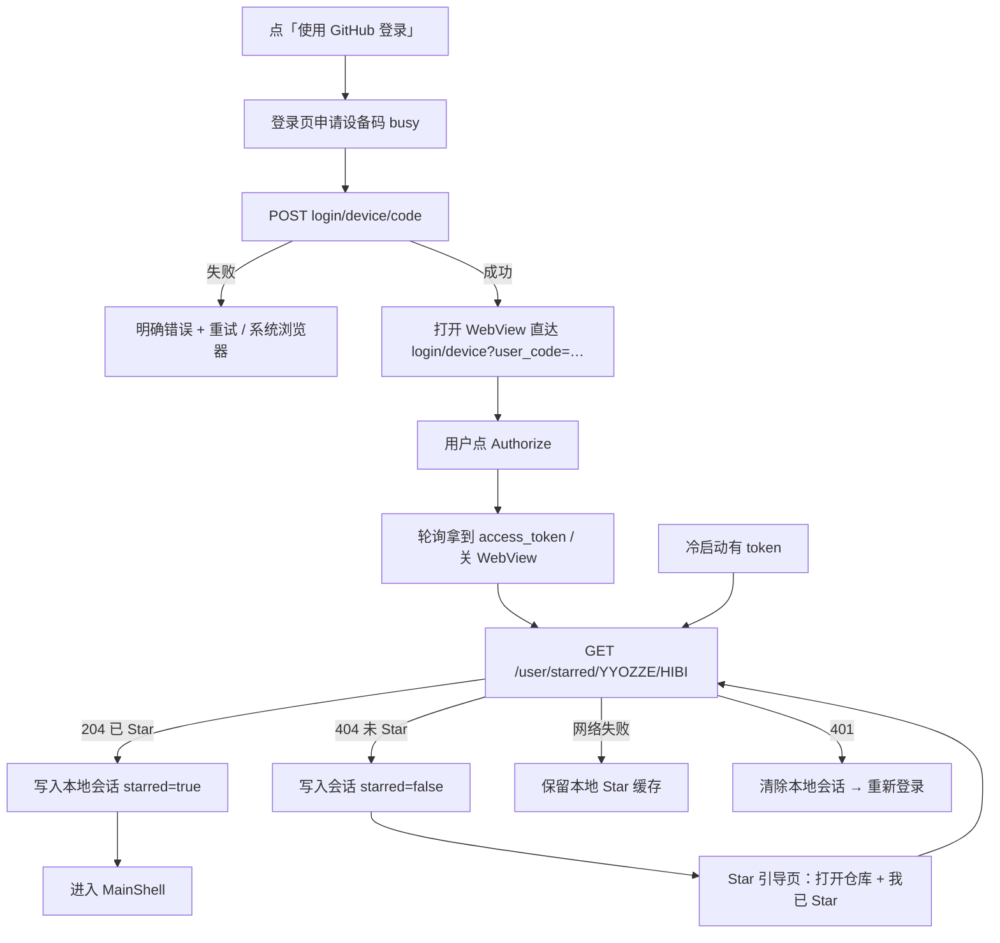

# GitHub 登录与 Star 门禁（无自建后端）

> **V4.0.1 起默认绕过本门禁**（打开即进主壳、助理开放；LAN 账号校验一并暂关）。  
> 功能细节、复现与复开指南见封存笔记：[`AUTH_GITHUB_SEALED.md`](./AUTH_GITHUB_SEALED.md)。  
> 总开关：`lib/config/auth_gate_config.dart` → `bypassGitHubLoginGate`。

自 **3.3.8** 起，客户端以 **GitHub OAuth Device Flow** 作为账号体系，并要求用户已 **Star** 仓库 [`YYOZZE/HIBI`](https://github.com/YYOZZE/HIBI)。无需自建登录服务器。

自 **3.3.10** 起：登录页在 App **内嵌 WebView** 打开 GitHub 验证页（密码只在 GitHub 网页输入）；失败时回退系统浏览器。HTTP 超时加长，错误提示为中文。

自 **3.3.11** 起：点「使用 GitHub 登录」后曾立刻打开 `https://github.com/login` 并并行申请设备码。HTTP 使用环境代理（`HTTPS_PROXY` 等），申请码失败会重试；网络不通时提示检查代理/VPN，并提供「在系统浏览器打开 GitHub」兜底。**不**经第三方加速反代 OAuth（避免 token 泄露）。

自 **3.3.12** 起：设备码到手即导航到带预填码的验证页；顶部说明验证码用途；监听授权成功文案后自动关闭内嵌页。

自 **3.3.13** 起：登录页文案精简；每轮**只申请一次** device/code（同源：顶栏码 / WebView URL / poll）。**默认内嵌 WebView**（`sameWindow` 处理 NewWindow），系统浏览器仅为次要入口。申请设备码有超时与「慢连接可取消」；**不做**自动填码/二次 `loadUrl`。**授权 ≠ 进 App，还必须 Star**。

### 访问状态机（`AppAccessState`）

| 状态 | 条件 | UI |
|------|------|-----|
| `notLoggedIn` | 无会话 | 登录页（GitHub / 本地账号） |
| `local` | 本地账号 | `MainShell`；助理关闭；不要求 Star |
| `githubNeedStar` | GitHub token 有、Star ≠ 204 | 登录页「去 Star」+「我已 Star」（不进主壳） |
| `githubOk` | GitHub token **且** Star 204 | `MainShell`；助理开放 |

局域网握手：`accountId` = GitHub `login`（小写）或本地稳定 `local_*` id。

冷启动：`ensureLoaded` 复检；永远落到登录/Star 页或主壳，不白屏。

> **Client ID 详细技术笔记**（含「勿建 GitHub App」、表单对照、发版注入、排障）：  
> [`GITHUB_OAUTH_CLIENT_ID.md`](./GITHUB_OAUTH_CLIENT_ID.md)

---

## 为何 App 内没有「GitHub 账号密码」输入框？

GitHub **禁止**第三方应用收集用户名/密码（也不安全）。正确方式是：用户在 **github.com** 网页完成登录与授权，App 只拿到 OAuth token。

希比流程对用户的直觉应是：

1. 点「使用 GitHub 登录」
2. 在 App 内嵌页（或系统浏览器）用 GitHub 账号密码登录并授权
3. 回到希比，按提示 Star 仓库后继续使用

---

## 警告：请建 OAuth App，不要建 GitHub App

| 页面标题 | 是否正确 |
|----------|----------|
| **Register a new OAuth application** / **OAuth Apps** | ✅ 正确 |
| **Register new GitHub App** / **Create GitHub App**（含 Webhook、Permissions、Install） | ❌ 取消，换入口 |

直达：**https://github.com/settings/developers** → 选 **OAuth Apps** → **New OAuth App**。

**务必在 OAuth App 详情页勾选 Enable Device Flow 并保存**，否则申请设备码会失败。

---

## 创建 OAuth App（推荐照抄）

1. Application name：`HIBI-2023`（或 `HIBI`）
2. Homepage URL：`https://github.com/YYOZZE/HIBI`
3. Authorization callback URL：`http://127.0.0.1`
4. 点 **Register application**
5. 详情页勾选 **Enable Device Flow** 并保存
6. 复制 **Client ID**（不要创建/使用 Client Secret）

---

## 配置 Client ID

任选其一：

```bash
# 推荐：构建时注入
flutter run --dart-define=GITHUB_CLIENT_ID=Ov23liXXXXXXXX
flutter build apk --release --dart-define=GITHUB_CLIENT_ID=Ov23liXXXXXXXX
flutter build windows --release --dart-define=GITHUB_CLIENT_ID=Ov23liXXXXXXXX
```

自 **3.3.9** 起，仓库内 `lib/config/github_oauth_config.dart` 的 `defaultClientId` **已写入正式 Client ID**，直接 `flutter build` / 安装官方包即可登录。仍可用 `--dart-define=GITHUB_CLIENT_ID=...` 覆盖。

**不要**把 Client Secret 放进客户端。

---

## 完整门禁流程（3.3.13）

**授权 ≠ 进 App。** 必须先完成 GitHub Device 授权拿到 token，再用该 token 证明已 Star `YYOZZE/HIBI`，才会进入 `MainShell`。



### 逐步说明

1. 点「使用 GitHub 登录」→ 登录页显示「正在申请设备码」（**此时不打开** `/login` / 仓库页 / 空 WebView）
2. `POST https://github.com/login/device/code` 申请 `user_code`（失败最多重试 3 次；失败则明确错误 + 重试 + 系统浏览器）
3. 码到手 → **才打开**内嵌 WebView，并 **强制** `loadUrl(verification_uri_complete 或 login/device?user_code=…)`（已登录也应直接到 Authorize / 确认页）
4. 用户点 **Authorize** → App 轮询 `access_token` → 关闭 WebView → `GET /user`
5. **Star 验证**（进 App 的真正门禁；授权 ≠ 进 App）：`GET https://api.github.com/user/starred/YYOZZE/HIBI`
   - **204** → 已 Star → `loginWithGitHub(starred: true)` → `MainShell`
   - **404** → 未 Star → 仍写入本地会话但 `starred: false` → 引导「打开仓库 Star」+「我已 Star，重新检查」
6. **冷启动**：有有效 token → 复检 Star；网络失败可保留缓存；**401 才清会话**重登

> **验证码（user_code）是什么？** 把「本次网页授权」与 App 轮询的 `device_code` 绑定。一般已通过 URL 预填；复制按钮仅作兜底。

网络：连接超时约 20s、请求超时约 45s；HttpClient 尊重 `HTTPS_PROXY`/`HTTP_PROXY`/`ALL_PROXY`。OAuth **不**走第三方 GitHub 加速镜像。

> 升级安装一般**不会**清掉本机登录态。若每次更新都要重新在网页输密码，属于异常（已在 3.3.10 加固双写与恢复）。

### 方案对照（已选型 B）

| 方案 | 说明 | 结论 |
|------|------|------|
| A. Authorization Code + loopback | 需回调/本机监听，配置更重 | 未采用 |
| **B. 内嵌 WebView + Device Flow** | 验证页嵌进 App，外层继续轮询 | **已落地** |
| C. 仅外跳系统浏览器 | 兜底 | 内嵌失败时使用 |

---

## 相关代码

| 文件 | 作用 |
|------|------|
| `lib/config/github_oauth_config.dart` | client_id / 仓库常量 |
| `lib/features/auth/services/github_oauth_service.dart` | Device Flow + Star API + 友好错误 |
| `lib/features/auth/widgets/github_device_webview.dart` | 内嵌 GitHub 验证页 |
| `lib/features/auth/github_login_page.dart` | 登录 / Star 引导 UI |
| `lib/app/initial_app_loader.dart` | 启动门禁 |
| `lib/features/auth/services/auth_repository.dart` | `loginWithGitHub` / 持久化 |
